# 🍔 Burger Menü Tablet Uygulaması

Bu uygulama, restoranlarda tablet üzerinden menü sunumu yapmak amacıyla geliştirilmiş bir **React Native** uygulamasıdır. İşletme, müşteri masaya oturduktan sonra masayı seçip tableti müşteriye verir. Müşteri tablet üzerinden menüyü inceleyebilir, ürünlerin içeriğini ve detaylarını görebilir. Siparişini oluşturduktan sonra tableti garsona teslim eder.

---

## 📸 Hamburger Ekran Görüntüleri

### 🔐 Giriş Ekranı
<p align="center">
  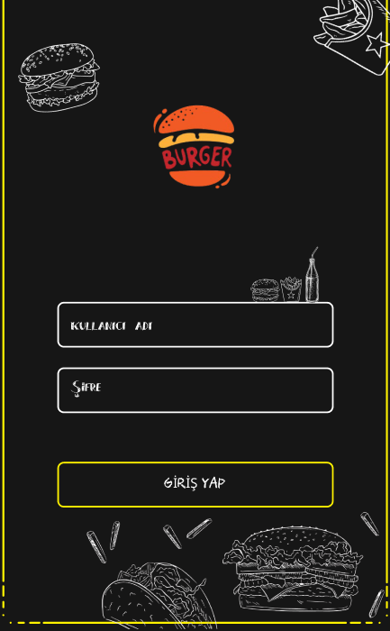
</p>

### 🪑 Masa Seçim Ekranı
<p align="center">
  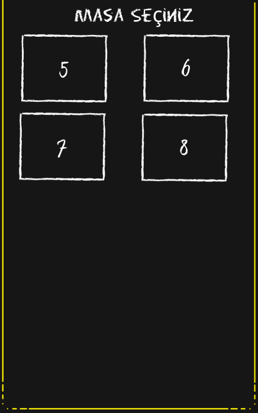
</p>

### 🍔 Menü Ekranı
<p align="center">
  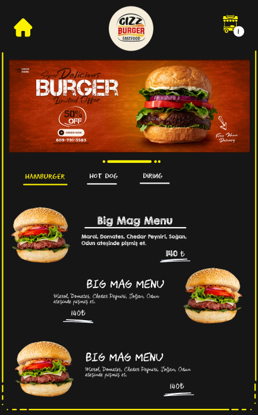
</p>

### 🍔 Ürün Detayı
<p align="center">
  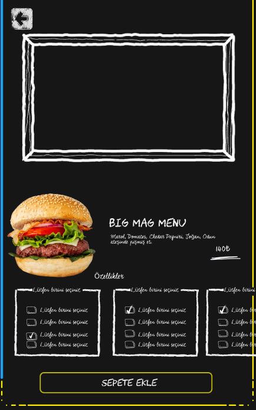
</p>

### 🍔 Sepet
<p align="center">
  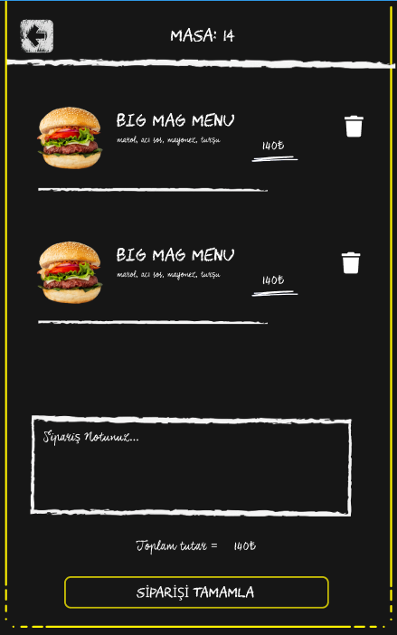
</p>

### 🍔 Order
<p align="center">
  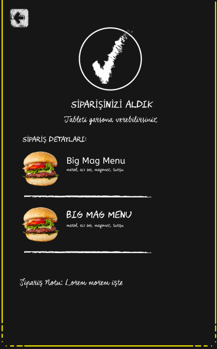
</p>

---

## 📸 Cafe Ekran Görüntüleri

### 🔐 Giriş Ekranı
<p align="center">
  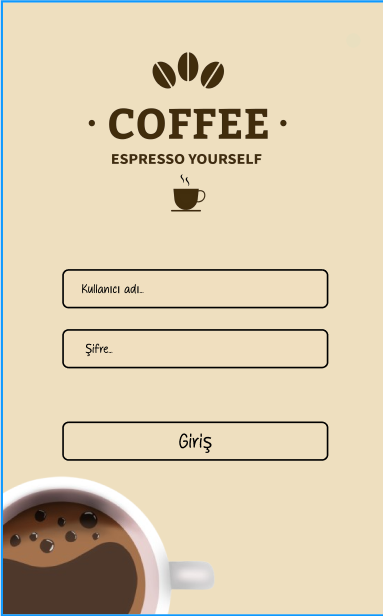
</p>

### 🪑 Masa Seçim Ekranı
<p align="center">
  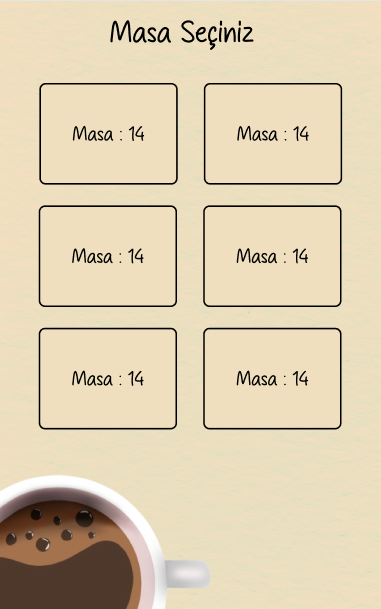
</p>

### 🍔 Menü Ekranı
<p align="center">
  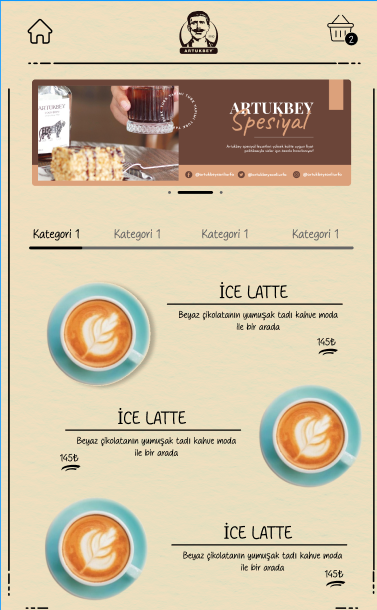
</p>

### 🍔 Ürün Detayı
<p align="center">
  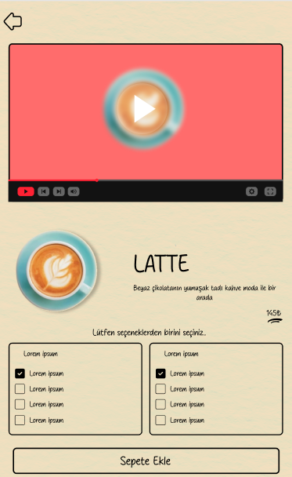
</p>

### 🍔 Sepet
<p align="center">
  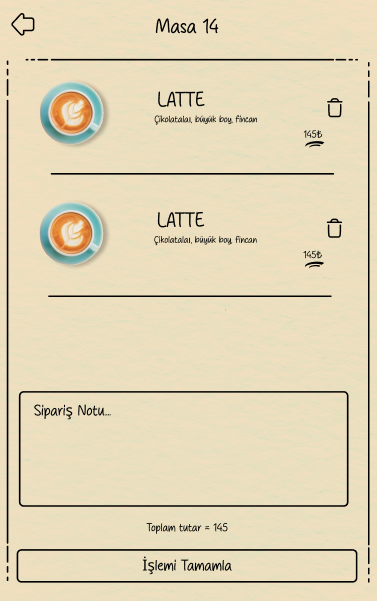
</p>

### 🍔 Order
<p align="center">
  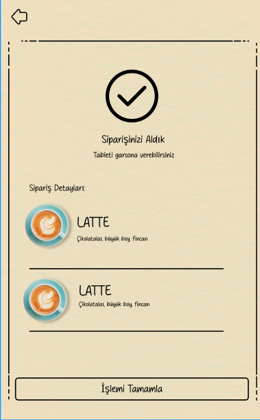
</p>

## ⚙️ Kullanılan Teknolojiler

Aşağıda proje geliştirilirken kullanılan başlıca paketler ve teknolojiler listelenmiştir:

- **React Native** `0.75.4`
- **React** `18.3.1`
- **React Navigation**
  - `@react-navigation/native-stack`
  - `@react-navigation/stack`
- **Redux & Redux-Saga**
  - `redux`
  - `react-redux`
  - `redux-saga`
- **UI & Animasyonlar**
  - `react-native-linear-gradient`
  - `react-native-vector-icons`
  - `react-native-bootsplash`
- **Veri Yönetimi**
  - `axios`
- **Medya & Webview**
  - `react-native-image-picker`
  - `react-native-webview`
  - `react-native-youtube-iframe`
- **Gesture & Güvenli Alanlar**
  - `react-native-gesture-handler`
  - `react-native-screens`
  - `react-native-safe-area-context`

---

## 🚀 Kurulum

```bash
cd RestaurantMenu
cd Hamburger
npm install
npx react-native run-android 
